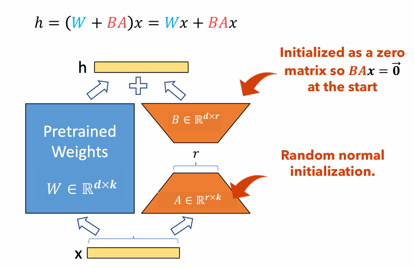

# Research Replication: LLM Fine-tuning for Code Vulnerability Detection

**Authors:** Yong-Hwan Lee, James Flora, Shijie Zhao, and Yunhan Qiao

A course research project at Oregon State University that reproduces *Finetuning Large Language Models for Vulnerability Detection* by Shestov et al. (2024). The study treats vulnerability detection as binary classification of Java functions: an LLM encodes each function, and a small classification head predicts whether that function is vulnerable. The original authors trained LoRA adapters. This project adapts their released code to train with 4-bit quantized weights plus LoRA (QLoRA) and records how sequence length and the handling of long functions relate to the results.

**Read the [report (PDF)](vuln_detection_finetune.pdf)** · [reproduction notes](docs/reproduction.md) · [experiment results](docs/experiment-results.md)

> **Current status:** this repository is a research snapshot, not a turnkey package. `run.py` contains an indentation error and a placeholder import path, so Python rejects the file before argument parsing, and even `--help` fails. The dependencies are unpinned, and a model compatible with the hardcoded GPTBigCode classes has to be chosen. See [docs/reproduction.md](docs/reproduction.md#known-blockers). The project QLoRA measurements are historical results from the team's 2024 work; the LoRA baselines are quoted from the upstream study. Neither set has been reproduced from this snapshot.

## Background: LoRA and QLoRA

<div align="center">



**Figure 1**: LoRA adapter illustration

</div>

LoRA (Hu et al., 2021) freezes a pretrained weight matrix $W \in \mathbb{R}^{d \times k}$ and learns a low-rank update $\Delta W = BA$, where $A \in \mathbb{R}^{r \times k}$ and $B \in \mathbb{R}^{d \times r}$. Only $A$ and $B$ are trained. They hold $r(d + k)$ parameters, compared with $dk$ in $W$, so a small rank $r$ makes fine-tuning much cheaper.

> For example, a layer with $W \in \mathbb{R}^{1000 \times 100}$ has $100{,}000$ parameters. With rank $r = 5$, the adapters hold $1000 \times 5 + 100 \times 5 = 5{,}500$ parameters, about 5% of $W$. Meanwhile, $W$ stays frozen.

QLoRA (Dettmers et al., 2023) also stores the frozen weights in 4-bit NormalFloat. The report estimates that quantization reduced the 13B model's footprint from about 26 GB to about 6 GB. That is a size estimate for the stored weights, not a measured training-memory requirement for this snapshot.

## Provenance

- **Upstream code.** This repository preserves the upstream history through commit [`48e6d41`](https://github.com/rmusab/vul-llm-finetune/commit/48e6d41d83cf6e250342304fa8cd5f07beba0451) of [rmusab/vul-llm-finetune](https://github.com/rmusab/vul-llm-finetune), the code repository linked in Section 4.4 of Shestov et al. Commit `889b022` then moved that tree into `vul-llm-finetune/`. The function-packing classifier (`GPTBigCodeClassificationSeveralFunc`), focal loss, the classification setup, and the Java datasets come from upstream; the classifier and focal-loss modules are byte-identical to upstream. The nested [LLM](vul-llm-finetune/LLM/README.md) and [LineVul](vul-llm-finetune/LineVul/README.md) READMEs are upstream documentation and describe the original authors' environment, not this project's setup.
- **Local changes.** The QLoRA method is from Dettmers et al.; this project's work is adapting the upstream code to use it and running the experiments. The later commits in `run.py` add 4-bit loading with a saved quantized copy (`--LLM_path`, `--model_path`, `--load_quantized_model`; `89aa13d`), safetensors adapter checkpoints (`603e0df`), and test metrics after training (`0ed2082`), along with environment/debug compatibility and logging changes.
- **Repository name.** This repository was previously published as `kapshaul/LLM-finetune-vuln-detection`.

## Repository layout

```text
.
├── README.md
├── docs/
│   ├── reproduction.md           # blockers, environment notes, intended commands
│   └── experiment-results.md     # reported table, figures and interpretation
├── LoRA.png                      # Figure 1 above
├── requirements.txt              # project-level Python dependencies (unpinned)
├── vuln_detection_finetune.pdf   # project report
└── vul-llm-finetune/             # code from rmusab/vul-llm-finetune, adapted
    ├── Datasets/
    │   ├── with_p3/java_k_1_strict_2023_06_30.tar.gz       # "X₁ with P₃"
    │   └── without_p3/java_k_1_strict_2023_07_03.tar.gz    # "X₁ without P₃"
    ├── LLM/
    │   ├── README.md, llm.Dockerfile, requirements.txt     # upstream docs and container
    │   └── starcoder/
    │       ├── finetune/
    │       │   ├── run.py                                  # main entry point: train / test
    │       │   ├── dataset.py                              # tar.gz loading, batch packing
    │       │   ├── gpt_big_code_classification_several_funcs.py  # per-function classifier
    │       │   ├── merge_peft_adapters.py                  # merge adapters into a base model
    │       │   └── debug_funcs.py                          # DDP debugging helpers
    │       ├── utils/calc_quality.py, utils/focal_loss.py  # metrics and focal loss
    │       └── next_token_prediction/llm_finetune_check.py # prompt-based check (not used in report)
    ├── LineVul/                  # upstream LineVul baseline (not used in report)
    └── ContraBERT/               # upstream ContraBERT baseline (not used in report)
```

The experiments in the report use only `LLM/starcoder/finetune/run.py` and the modules it imports.

## What is and isn't included

| Item | Status |
| --- | --- |
| Java datasets | Both archives are included. Each holds `train.jsonl`, `valid.jsonl`, and `test.jsonl`; the loader uses the `code` and `target` fields. Checked-in counts: **with P₃** 13,247 / 5,131 / 4,576 (train/valid/test), 22,954 in total; **without P₃** 810 / 272 / 252, 1,334 in total. The report's count for "with P₃" is 22,945, which appears to be a digit transposition. |
| Base LLM weights | Not included. `--LLM_path` defaults to `TheBloke/Wizard-Vicuna-13B-Uncensored-HF`, but the report says it used WizardCoder, and the model classes are hardcoded to GPTBigCode. The default does not identify the trained model, and its compatibility is unverified. |
| Quantized model cache | Not included. `--load_quantized_model` reads it from `--model_path`. Without that flag, the script loads `--LLM_path` in 4-bit and saves the result to `--model_path`. |
| Trained adapters / checkpoints | Not included. The reported results can't be re-evaluated without retraining. |
| Training logs | Not included. The per-epoch curves survive only as figures in the PDF. |

## Entry points

- **Train:** `run.py` with neither `--run_test` nor `--run_test_peft`. It fine-tunes LoRA adapters, evaluates on the validation split after each epoch, and keeps the adapter with the best validation ROC AUC. At the end of training, it reloads that adapter, saves it to `<output_dir>/final_checkpoint/`, and prints test metrics.
- **Evaluate a trained adapter:** `run.py --run_test_peft --checkpoint_dir <dir> --model_checkpoint_path <subdir>`.
- **Evaluate without adapters:** `run.py --run_test`.

`--split` does not select the mode. For argument meanings, environment caveats, and example commands, see [docs/reproduction.md](docs/reproduction.md).

## Results summary

The team's best recorded QLoRA runs reached a test ROC AUC of 0.72 on the imbalanced "X₁ with P₃" dataset and an F1 score of 0.66 on the balanced "X₁ without P₃" dataset. Both are below the LoRA numbers published by Shestov et al. (0.86 ROC AUC and 0.71 F1), which this project quotes rather than reruns, so the comparison is not a controlled ablation. For each dataset, the table has one 512-token pair that differs in long-function handling ("ignore" drops over-length functions, "include" truncates them), and the "include" run scored higher in both pairs. That is an association from two comparisons: the paired runs also used different GPUs, the number of repetitions is not stated, and no significance test was done. The evidence on sequence length was inconclusive.

The snapshot's evaluation code picks the F1-maximizing threshold on the same labels it scores, including the test split. This affects metrics printed by that code path and may affect the project measurements if they used it; it does not establish how the quoted upstream baselines were evaluated. The full table, figure references, and caveats are in [docs/experiment-results.md](docs/experiment-results.md).

## References

[1] Shestov, A., Levichev, R., Mussabayev, R., Maslov, E., Cheshkov, A., & Zadorozhny, P. (2024). *Finetuning Large Language Models for Vulnerability Detection*. arXiv preprint arXiv:2401.17010. Retrieved from [https://arxiv.org/abs/2401.17010](https://arxiv.org/abs/2401.17010). Code: [https://github.com/rmusab/vul-llm-finetune](https://github.com/rmusab/vul-llm-finetune).

[2] Hu, E. J., Shen, Y., Wallis, P., Allen-Zhu, Z., Li, Y., Wang, S., & Chen, W. (2021). LoRA: Low-Rank Adaptation of Large Language Models. arXiv preprint arXiv:2106.09685. Retrieved from https://arxiv.org/abs/2106.09685.

[3] Dettmers, T., Pagnoni, A., Holtzman, A., & Zettlemoyer, L. (2023). QLoRA: Efficient Finetuning of Quantized LLMs. arXiv preprint arXiv:2305.14314. Retrieved from https://arxiv.org/abs/2305.14314.
